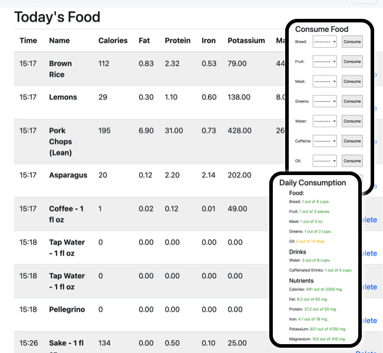
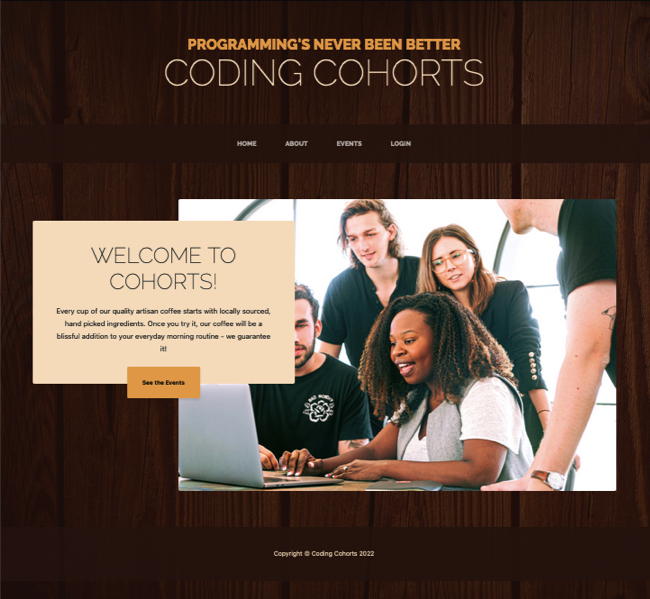
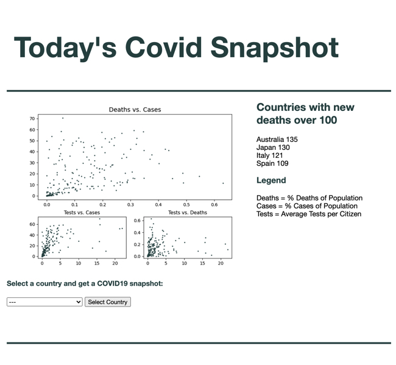

Title: Python Dev
Category: Portfolio
Date: 2023-01-01
Slug: python-development

## Work Samples

  <ul class="cards">
    <li class="cards_item">
      

        

        

          <h2 class="card_title">Responsive Dashboard. Forms, Filtering and Food Tracking.</h2>
          
<b>Tech:</b> Django, Python, HTML, CSS, BootStrap, postgresql.

          
With many diets, it feels like you don't eat enough and don't get enough of a variety to cover your daily nutrients. The app keeps tabs on how much you've consumed in a day as well as totalling essential nutrients and calories.

          <a href="https://github.com/peayah/eatright"><button class="btn card_btn">GitHub</button></a>
        

      

    </li>
    <li class="cards_item">
      

        

        

          <h2 class="card_title">Browser Front-end, User Dashboards, & Admin Back-end</h2>
          
<b>Tech:</b> Django, Python, HTML, CSS, BootStrap, postgresql.

          
Without logging in, website lists open programming cohorts. Once logged in, user can see the list of cohorts they are leading with a list of participants as well as a list of cohorts they are attending as a member.

          <a href="https://github.com/peayah/cohortCommunityApp"> <button class="btn card_btn">GitHub</button></a>
        

      

    </li>
    <li class="cards_item">
      

        

        

          <h2 class="card_title">Browser Front-end, User Dashboards</h2>
          
<b>Tech:</b> Flask, HTML, CSS.

          
...

          <a href=""> <button class="btn card_btn">GitHub</button></a>
        

      

    </li>
    <li class="cards_item">
      

        

        

          <h2 class="card_title">Expoloratory Data Analysis of Online Sales.</h2>
          
<b>Tech:</b> Scikit-learn, pandas, SQL, matplotlib, Seaborn.

          
Evaluating product performance as standalone product vs add-on product. Limited exploration of markets.
          <a href="https://www.kaggle.com/datasets/knightbearr/sales-product-data">Data</a>

          <a href="salesreport.html"> <button class="btn card_btn">Analysis</button></a>
       

      

    </li>
    <li class="cards_item">
      

        

        

          <h2 class="card_title">Tkinter App Interface for running multi-graph report</h2>
          
<b>Tech:</b> tkinter, pandas, matplotlib, numpy

          
...
          <a href="">data</a>

          <a href=""> <button class="btn card_btn">Github</button></a>
        

      

    </li>

  </ul>

