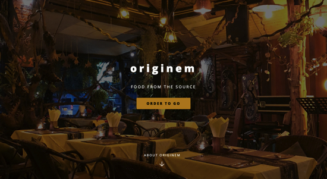
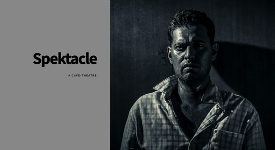

Title: Web Dev
Category: Portfolio
Date: 2023-01-01
Slug: web-development

## Why your website is important
Today customers expect legitimate businesses to have a website. An effective website works in your favor and helps bring your ideas and message to your potential customers.

It would be my honor to help you develop a website that works for you. I'm equally comfortable building one from the ground up, or updating your existing website so it looks equally great on desktops, tablets and mobile phones.

Let's meet at a coffee shop (or Zoom if you prefer) and talk about what you have in mind.

##The Process
The talk. We'll meet and talk about what you have in mind. Where you are at and where you are heading.

The Plan. We will write up a plan to get your website in shape.

The Development. Depending on the length of the project, I will provide regular updates if needed.

The Launch. Once your new website is ready to go live, I will make sure you know how to maintain and update it and I will be available for ongoing support.

Let's talk!
pia@piasmith.com

## Work Samples
Below is a variation of past works samples. Hope they will inspire you!

  <ul class="cards">
   <li class="cards_item">
      

        

        

          <h2 class="card_title">Abigails', Boutique Hair Shop</h2>
          
A website that is fully responsive and looks equaly great on the customer's laptop, tablet or phone.

          <a href="https://peayah.github.io/abigails/"><button class="btn card_btn">Live Site</button></a>
        

      

    </li>
    <li class="cards_item">
      

        

        

          <h2 class="card_title">originem, Allergy Friendly Eatery</h2>
          
Restaurant serving gluten-free, dairy free food. Stay at their spacious place or order to go from their web

          <a href="https://peayah.github.io/originem/"><button class="btn card_btn">Live Site</button></a>
        

      

    </li>
    <li class="cards_item">
      

        

        

          <h2 class="card_title">Spektacle, Community Websit</h2>
          
Theatre and cabaret community. Performances and workshops. Entertain and be entertained.

          <a href="https://peayah.github.io/spektacle/"><button class="btn card_btn"> Live Site</button></a>
        

      

    </li>
  </ul>

